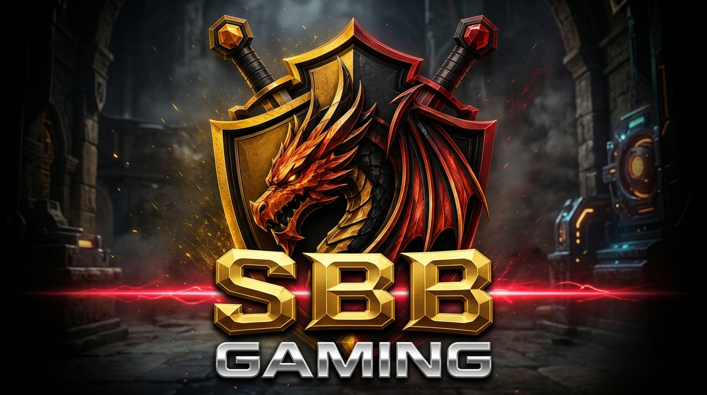

# SBB GAMING — Cinematic Identity & Engineering Portfolio

<div align="center">



### **Gamer • Developer • Editor • Tech**
*A personal creative identity built around high-tier gaming, full-stack software engineering, cinematic video editing, and futuristic technology.*

[](https://react.dev/)
[](https://www.typescriptlang.org/)
[](https://vitejs.dev/)
[](https://threejs.org/)
[](https://greensock.com/gsap/)
[](https://vercel.com/)

[**Live Demo**](https://github.com/Harishsbb/sbb_portfolio) • [**YouTube Channel**](https://www.youtube.com/@sbbgamingff2001) • [**Instagram**](https://www.instagram.com/harishk_sbb?stkn=MWJzZ3pkMHd3ZTI4bg==) • [**1-Click Vercel Deploy**](https://vercel.com/new/clone?repository-url=https%3A%2F%2Fgithub.com%2FHarishsbb%2Fsbb_portfolio)

</div>

---

## 🌟 Highlights & Key Features

### 🎬 250-Frame Global Cinematic Scroll Animation
- Custom frame-by-frame canvas engine synchronized directly with user scrolling using **Lenis** smooth scroll.
- Pre-cached 300 HD frames illustrating the fiery dragon ignition, particle turbulence, crest impact, and golden shield climax.
- Built-in hardware-accelerated canvas filter (`brightness`, `contrast`, `saturate`) preserving maximum visual punch across all displays.

### 🛡️ Pure Native 3D Metallic Esports Typography
- High-impact, zero-raster-artifact brand identity rendered purely in HTML + CSS.
- Multi-stop metallic gold gradient (`#FFFFFF` to deep bronze `#472800`), 3D chiseled bevel lighting, and crimson laser beam accents.
- Pre-loaded with top-tier gaming typefaces: **Goldman**, **Orbitron**, **Oxanium**, and **Chakra Petch**.

### 🔊 Interactive Audio Engine
- Built-in procedural sound engine utilizing the **Web Audio API**.
- Low-latency tactile feedback: hover ticks, metallic clicks, and a global audio toggle HUD button.

### ⚡ 4 Pillars of Excellence
- **🎮 GAMER**: Competitive battle royale, tactical shooters, and open-world adventures (*Free Fire, Call of Duty, PUBG, Hogwarts Legacy, R.E.P.O., Phasmophobia, Minecraft, Spider-Man, Ben 10*).
- **💻 DEVELOPER**: Engineering production platforms, computer vision pipelines, and embedded IoT architectures.
- **🎬 EDITOR**: Frame-accurate 4K 60FPS kinetic edits, beat-synchronized motion graphics, and atmospheric sound design.
- **⚡ TECH**: Real-time WebGL 3D shaders, microcontroller sensor arrays, and distributed microservices.

### 🛠️ Tech Arsenal HUD Decks
- 4 glassmorphic cyber decks with frosted backdrops (`blur(16px)`):
  - **`01 // UI` Frontend Architecture**: React, TypeScript, Tailwind CSS, GSAP, HTML5/CSS3, Three.js
  - **`02 // CORE` Backend Systems**: Node.js, Express, Java, Spring Boot, Go, Python
  - **`03 // DATA` Data & Storage**: MySQL, PostgreSQL, MongoDB, Redis, RESTful API
  - **`04 // OPS` Cloud & Arsenal**: AWS, Docker, Git, GitHub Actions, Linux, Vite

### 🚀 Production Engineering Projects
1. **AprilTag-Based Goat Monitoring System**: Real-time precision livestock tracking using OpenCV and 6-DOF AprilTag pose estimation algorithms on edge hardware.
2. **Self-Shopping Smart Trolley**: Autonomous IoT retail cart with RFID/barcode dual verification, load-cell weight cross-validation, and instant digital checkout.
3. **Core Banking Engine**: High-concurrency ACID-compliant ledger engine in Java & Spring Boot with cryptographic auditing.
4. **Student Course Management System**: Full-stack academic ERP scheduling platform with automated timetable conflict resolution.

---

## 🧰 Tech Stack

| Domain | Technology |
|---|---|
| **Core Framework** | React 19, TypeScript, Vite 6 |
| **3D & Shaders** | Three.js, `@react-three/fiber`, `@react-three/drei` |
| **Kinetic Motion** | GSAP (GreenSock), Lenis Smooth Scroll |
| **Icons & Typography** | Lucide React, Google Fonts (*Goldman, Orbitron, Oxanium, Chakra Petch, Space Mono, Inter*) |
| **Audio** | Native Web Audio API |
| **Deployment** | Vercel Edge Network, SPA rewrites, Edge CDN immutable asset caching |

---

## 📂 Project Architecture

```
sbb-portfolio/
├── public/
│   ├── ezgif-845a2d8ad4709186-png-split/  # 300-frame cinematic dragon sequence
│   ├── sbb-gaming-logo-official.png       # Official reference crest
│   ├── sbb-logo-hd.png                    # Brand header banner
│   └── ...
├── src/
│   ├── components/
│   │   ├── Intro/
│   │   │   ├── GlobalFrameSequence.tsx    # Scroll-driven 250-frame canvas engine
│   │   │   ├── IntroLoader.tsx            # Preloader & initialization sequence
│   │   │   └── ScrollFrameSequence.tsx
│   │   ├── About.tsx                      # 4 Pillars of SBB
│   │   ├── Creations.tsx                  # Media & creative archive
│   │   ├── Development.tsx                # Software engineering showcase
│   │   ├── Editing.tsx                    # Video editing studio & timeline
│   │   ├── Footer.tsx                     # Closing contact & social links
│   │   ├── Gaming.tsx                     # Gaming highlights & YouTube feeds
│   │   ├── Hero.tsx                       # SBB GAMING 3D metallic hero section
│   │   ├── Navbar.tsx                     # Minimalist HUD navigation & menu
│   │   └── Tech.tsx                       # 4-card glassmorphic arsenal HUD
│   ├── data/                              # Structured project & social datasets
│   ├── utils/audio.ts                     # Web Audio API sound synthesizer
│   ├── index.css                          # Cyberpunk design system & metallic typography
│   └── main.tsx
├── index.html                             # Preloaded Google Fonts & SEO meta tags
├── vercel.json                            # Vercel SPA routing & Edge CDN cache rules
└── vite.config.ts                         # Vite configuration
```

---

## 🚀 Getting Started

### Prerequisites
- [Node.js](https://nodejs.org/) (version 18 or higher recommended)
- `npm` or `yarn` or `pnpm`

### Installation

1. **Clone the repository:**
   ```bash
   git clone https://github.com/Harishsbb/sbb_portfolio.git
   cd sbb_portfolio
   ```

2. **Install dependencies:**
   ```bash
   npm install
   ```

3. **Start the local development server:**
   ```bash
   npm run dev
   ```
   Open `http://localhost:5173` in your browser.

4. **Build for production:**
   ```bash
   npm run build
   ```
   The production build output will be generated in the `dist/` directory.

5. **Preview the production build locally:**
   ```bash
   npm run preview
   ```

---

## 🌐 Deploying to Vercel

### Option 1: 1-Click Deploy (Fastest)
Deploy immediately using the pre-configured Vercel template:

[](https://vercel.com/new/clone?repository-url=https%3A%2F%2Fgithub.com%2FHarishsbb%2Fsbb_portfolio)

### Option 2: Via Vercel Web Dashboard
1. Go to [vercel.com/new](https://vercel.com/new).
2. Log in with your GitHub account.
3. Import **`Harishsbb/sbb_portfolio`**.
4. Framework Preset will auto-detect as **Vite**.
5. Click **Deploy**.

> **Note**: This repository includes a customized [`vercel.json`](./vercel.json) that automatically configures single-page application (SPA) rewrites and sets `Cache-Control: public, max-age=31536000, immutable` for all 250 animation frames, ensuring instant global loading across Vercel's Edge CDN.

---

## 🎮 Official Channels & Socials

- 🔴 **YouTube**: [@sbbgamingff2001](https://www.youtube.com/@sbbgamingff2001)
- 📸 **Instagram**: [@harishk_sbb](https://www.instagram.com/harishk_sbb?stkn=MWJzZ3pkMHd3ZTI4bg==)
- 💼 **LinkedIn**: [Harish Kumar](https://www.linkedin.com/in/harishk06944/)
- 💻 **GitHub**: [Harishsbb](https://github.com/Harishsbb)

---

## 📄 License

This project is created for **SBB GAMING**. All rights reserved. Code is provided under the [MIT License](LICENSE).
